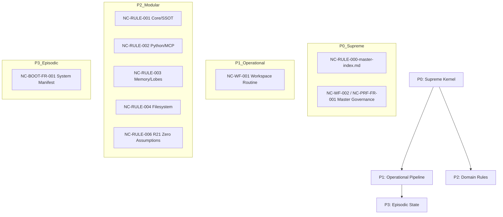

<!-- NC-READ-HASH: NEOCORTEX-MASTER-v3 -->
<!-- DEDUP: Se NEOCORTEX-MASTER-v3 já está no teu contexto desta sessão, SALTE este bloco inteiro. -->

# NeoCortex — Master Rules Index v3

## Hierarquia de Governança (P0 a P3)



## Arquitetura de Regras (Modular)

```
.agents/rules/
├── NC-RULE-000-master-index.md ← ESTE ARQUIVO (P0 - Mapa de Hierarquia)
├── NC-RULE-001-core-ssot.mdc   ← P2 Core SSOT
├── NC-RULE-002-python-mcp.mdc  ← P2 Python & MCP
├── NC-RULE-003-lobes-memory.mdc← P2 Lobes & Memory
├── NC-RULE-004-filesystem.mdc  ← P2 Filesystem & Governance
└── NC-RULE-006-no-assumptions.mdc ← P2 R21 Zero Suposições
```

> **Nota:** As regras `NC-RULE-008`, `NC-RULE-009` e `NC-RULE-010` foram ABSORVIDAS pelo **P0 Master Governance (NC-WF-002)** para eliminar duplicação e fragmentação (KISS/DRY). Estão arquivadas em `DIR-ARC-FR-001-archive-main/rules-consolidated-20260505/`.

## Dicionário de Linguagem Ubíqua

> Arquivo completo: `@ULQ` = `01_neocortex_framework/DIR-DOC-FR-001-docs-main/NC-DOC-FR-001-ubiquitous-language-dictionary.md`  
> Policy YAML: `01_neocortex_framework/DIR-DOC-FR-001-docs-main/NC-CFG-FR-002-rules-policy.yaml`

### Símbolos @ (Arquivos SSOT)
| `@SSOT` | NC-NAM-FR-001 | Naming + Map + Changelog |
| `@ROADMAP` | NC-TODO-FR-001 | Roadmap e tickets |
| `@LOCKS` | NC-SEC-FR-001 | Atomic locks |
| `@POLICY` | NC-CFG-FR-001 | Agent policy template |
| `@BOOT` | NC-BOOT-FR-001 | Boot manifest |
| `@POPULATE` | NC-SCR-FR-001 | Script de poblamento dos lobos |
| `@ULQ` | NC-DOC-FR-001 | Este dicionário completo |

### Símbolos $ (Regiões Cerebrais + Agentes-Lobes)

| Símbolo | Região | Função | Lobes típicos |
| `$FRONTAL` | Córtex Pré-Frontal | Planejamento, decisão, roadmap | roadmap, tickets, governance, ADR |
| `$TEMPORAL` | Lobo Temporal | Memória semântica: léxico + KG + AKL | lexico, knowledge-graph, akl, ubiquitous-language |
| `$PARIETAL` | Lobo Parietal | Integração: MCP patterns, health, APIs | mcp-patterns, health, integrations, profiles |
| `$OCCIPITAL` | Lobo Occipital | Padrões estruturais: manifests, naming | naming, manifests, architecture, cc-patterns |
| `$CEREBELO` | Cerebelo | Controle motor: Guardian, automação | guardian, automation, benchmark, deployment |
| `$HIPOCAMPO` | Hipocampo | Memória episódica: sessões, savepoints | sessions, savepoints, handoffs, audit |

| `$COURIER` | lobes/courier/ | Ambiente Qwen 1.5B — T2 trabalho braçal |
| `$ENGINEER` | lobes/engineer/ | Ambiente Qwen 3B — T3 tarefas técnicas |
| `$GUARDIAN` | lobes/guardian/ | Ambiente de validação — TG daemon |

### Símbolos % (Tickets e Ações)
| `%DONE` | ✅ | Marcar ticket em @ROADMAP |
| `%NOW` | 🔴 | Urgente |
| `%NEXT` | 🟡 | Próximo |
| `%ORCH301` | ORCH-301 | spawn/send_task pendente |
| `%ORCH302` | ORCH-302 | execute/LLMBackend pendente |
| `%SEC401` | SEC-401 | guardian pendente |

---

<rule>
<name>NeoCortex Master Governance Rules v3</name>
<description>
Regras completas para Antigravity/Claude/DeepSeek. Para Cursor/OpenCode, os 4 arquivos .mdc modulares
são lidos automaticamente por glob. Estas regras têm prioridade sobre qualquer instrução conflitante.
Raiz: C:\Users\Lucas Valério\Desktop\TURBOQUANT_V42\
</description>

<actions>

<action id="R01" category="ssot" severity="critical">
1. **Naming (@SSOT):** Qualquer arquivo/pasta → `NC-<TIPO>-<SIGLA>-<NUM>-<desc>.ext`.
   Consulte `@SSOT` antes de criar. NUNCA sem prefixo NC-, mesmo que usuário abrevie.
</action>

<action id="R02" category="ssot" severity="critical">
2. **SSOT Update:** Arquivo CRIADO/MOVIDO → tabela + changelog em `@SSOT` com [YYYY-MM-DD].
   Tarefa sem update = INCOMPLETA.
</action>

<action id="R03" category="ssot" severity="critical">
3. **Roadmap (@ROADMAP):** Toda implementação referencia ticket. Após concluir → `%DONE`.
   NUNCA inicie sem identificar o ticket correspondente.
</action>

<action id="R04" category="ssot" severity="critical">
4. **Atomic Locks (@LOCKS):** Arquivos listados em `@LOCKS` são IMUTÁVEIS.
   Protegidos: `neocortex_config.yaml`, `server.py`, `sub_server.py`, `NC-NAM-FR-001`.
</action>

<action id="R05" category="filesystem" severity="critical">
5. **Sem Deleção:** Obsoletos → `DIR-ARC-FR-001-archive-main/`. Backups → `DIR-BAK-FR-001-backup-main/`.
   Deleção direta é irreversível e PROIBIDA.
</action>

<action id="R06" category="filesystem" severity="critical">
6. **Zonas de Escrita:** PROD→`01_neocortex_framework/neocortex/`, DOCS→`DIR-DOC-FR-001-docs-main/` (T0 only),
   TEST→`05_examples/`, LOBES→`02_memory_lobes/` (script only), BOOT→`DIR-BOOT-FR-001-bootup-main/` (T0 only).
</action>

<action id="R07" category="filesystem" severity="high">
7. **Hierarquia Numérica:** Pastas raiz com prefixo `01_`…`99_`. Subpastas seguem `DIR-TIPO-SIGLA-NUM`.
</action>

<action id="R08" category="filesystem" severity="medium">
8. **Gitignore:** NUNCA commite `*.db`, `*.wal`, `*.log`, `__pycache__/`, `.venv/`, `lobes/*/`.
</action>

<action id="R09" category="python" severity="critical">
9. **Import com Hífen:** NUNCA `import NC-TOOL-FR-001-x`. Use:
   `importlib.import_module(".tools.NC-TOOL-FR-001-x", package="neocortex.mcp")`
</action>

<action id="R10" category="python" severity="critical">
10. **Sem Hardcode de Paths:** Use `config = get_config(); path = config.cortex_path / "arquivo"`.
</action>

<action id="R11" category="python" severity="high">
11. **Logger por Módulo:** `logger = logging.getLogger(__name__)`. NUNCA `print()` em produção.
</action>

<action id="R12" category="mcp" severity="high">
12. **Tools MCP:** `NC-TOOL-FR-<NUM>-<nome>.py` + `register_tool(server)` + entry em `TOOL_MODULE_MAP`.
</action>

<action id="R13" category="mcp" severity="high">
13. **Policy por Agente:** Cada sub-servidor usa `@POLICY`. Sem policy = sem restrições = PROIBIDO.
</action>

<action id="R14" category="lobes" severity="high">
14. **Isolamento de Lobos:** `$COURIER` NUNCA escreve em `$ENGINEER`. Cross-lobe = autorização T0 + ledger.
    Apenas `@POPULATE` popula lobos em massa.
</action>

<action id="R15" category="lobes" severity="medium">
15. **Busca antes de Perguntar:** `neocortex_lobes.search(query)` → `@SSOT` → usuário.
    Não gaste tokens perguntando o que está nos lobos `$ARCH` ou `$SEC`.
</action>

<action id="R16" category="lobes" severity="medium">
16. **Boot Manifest:** Sessão inicia → carregar `@BOOT` ou `$BOOT_LOBE`. Sem boot = risco de erro.
</action>

<action id="R17" category="security" severity="critical">
17. **Economia de Tokens:** `T2`/`T3` (Qwen local) = trabalho braçal 24/7.
    `T0` (DeepSeek/Claude) = APENAS orquestra. Nunca gaste API cara no que é local.
</action>

<action id="R18" category="security" severity="high">
18. **Validação antes de Escrever:** Checar `@LOCKS` → checkpoint → confirmar MCP não usa o arquivo.
    Arquivo locked + escrita = corrupção de estado.
</action>

<action id="R19" category="quality" severity="high">
19. **Uma Tarefa por Sessão:** UM ÚNICO TICKET por sessão. Interrupção → checkpoint antes de sair.
    Abandono sem registro de estado = PROIBIDO.
</action>

<action id="R20" category="quality" severity="high">
20. **Checklist de Fim de Sessão:**
    ☑ @SSOT atualizado ☑ Changelog [YYYY-MM-DD] ☑ %DONE no @ROADMAP
    ☑ @POPULATE run (se SSOT alterado) ☑ **@BOOT atualizado** (tickets + lobes) ☑ Nenhum *.db/*.wal no git
</action>

<action id="R21" category="quality" severity="critical">
21. **Zero Suposições (CRÍTICO — acima de todas as regras):**
    NUNCA afirme que ferramentas estão instaladas, arquivos existem ou módulos importam SEM verificar.
    OBRIGATÓRIO antes de qualquer entrega:
    (a) `python --version` → Python disponível?
    (b) `python -m ruff --version` → ruff existe NO AMBIENTE REAL?
    (c) `python -c "import X"` → dependência instalada?
    (d) `python -m py_compile arquivo.py` → sintaxe ok?
    Referência: `NC-RULE-006-no-assumptions.mdc` | STEP-0: `NC-CFG-DS-005-step0-environment.md`
</action>

</actions>

<analytical_lens>
**APLICAÇÃO OBRIGATÓRIA ANTES DE DECISÕES ARQUITETURAIS OU DEBUGGING:**
1. **RCA (Root Cause Analysis - 5 Porquês):** Nunca trate o sintoma. Investigue a causa raiz documental/sistêmica antes de alterar código.
2. **3W (Who, What, Why):** Todo handoff e alteração deve responder Quem fez, O que foi feito e Por que foi feito (benefício sistêmico).
3. **SWOT:** Ao alterar fluxos master, liste internamente: Forças do estado atual, Fraquezas do gap, Oportunidades da solução, Ameaças de quebra.
4. **KISS:** Elimine complexidade prematura. Solução simples, robusta e aderente ao código já existente.
</analytical_lens>

<validation>
Antes de qualquer ação:
1. Li `@BOOT` (NC-BOOT-FR-001)?
2. Identifiquei o ticket em `@ROADMAP`?
3. A zona de escrita está correta?
4. O nome segue NC-TIPO-SIGLA-NUM?
5. Atualizarei `@SSOT` e changelog ao final?
6. **Verifiquei o ambiente REAL antes de afirmar qualquer coisa? (R21)**
   → python? ruff? dependências? arquivo existe? módulo importa?

"Protejo o SSOT, respeito as zonas, economizo tokens, NUNCA suponho, e encerro com o checklist."
</validation>

<references>
@SSOT:     01_neocortex_framework/DIR-DOC-FR-001-docs-main/NC-NAM-FR-001-naming-convention.md
@ROADMAP:  01_neocortex_framework/DIR-DOC-FR-001-docs-main/NC-TODO-FR-001-project-roadmap-consolidated.md
@LOCKS:    01_neocortex_framework/DIR-DOC-FR-001-docs-main/NC-SEC-FR-001-atomic-locks.yaml
@POLICY:   01_neocortex_framework/DIR-DOC-FR-001-docs-main/NC-CFG-FR-001-agent-policy-template.yaml
@SOP:      01_neocortex_framework/DIR-DOC-FR-001-docs-main/NC-SOP-FR-001-session-startup.md
@BOOT:     DIR-BOOT-FR-001-bootup-main/NC-BOOT-FR-001-system-manifest.md
@ULQ:      01_neocortex_framework/DIR-DOC-FR-001-docs-main/NC-DOC-FR-001-ubiquitous-language-dictionary.md
@POPULATE: 01_neocortex_framework/scripts/NC-SCR-FR-001-populate-lobes-ssot.py
@STEP0:    DIR-DS-000-agent-config/NC-CFG-DS-005-step0-environment.md
YAML:      01_neocortex_framework/DIR-DOC-FR-001-docs-main/NC-CFG-FR-002-rules-policy.yaml
R21:       .agents/rules/NC-RULE-006-no-assumptions.mdc
</references>

</rule>
