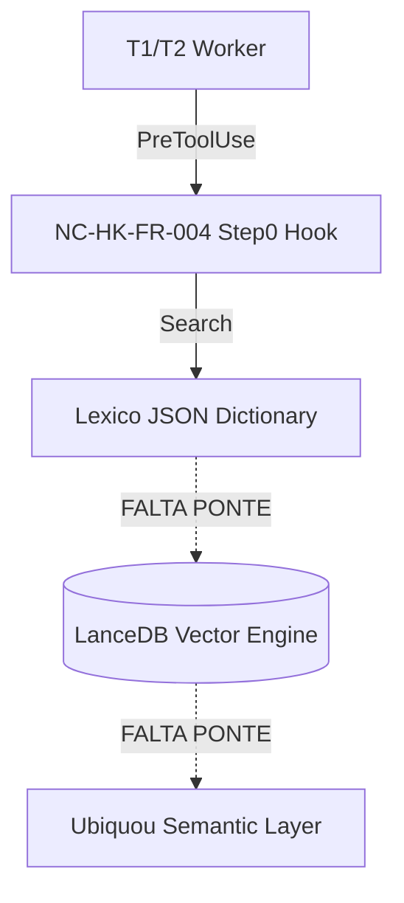

# NC-REP-FR-001: Semantic Integration Audit (Lexico → LanceDB → Ubiquou)

> **Objective:** Mapear fluxo de dados e garantir integração.

## 1. Conexão Lexico → LanceDB
- 🔴 **Desconectado:** `NC-CORE-FR-116` armazena dados puramente em JSON (`NC-LEXICO-*.json`). Nenhum hook nativo exportando tensores ou hashes lexicais para o LanceDB local foi detectado no arquivo.

## 2. Status Hooks `lexico-step0`
- 🟢 **Hook Step0 Ativo:** Escutando comandos de serviço (Orchestration, Memory, Security) com PreToolUse.

## 3. Compressão Semântica (LanceDB)
- 🟢 Diretório VectorDB encontrado no fallback `C:\Users\Lucas Valério\Desktop\TURBOQUANT_V42\01_neocortex_framework\data\vector_db`.

## 4. Diagnóstico e Diagrama

**Aviso Arquitetural:** O fluxo está fragmentado. O agente acessa o Léxico, mas a persistência pesada (LanceDB) não está automaticamente sincronizando esses termos. Precisaremos da Fase 2.2 para conectar ativamente a *Knowledge Graph Builder* e o *Lexico* ao LanceDB para pruning e transações otimizadas.